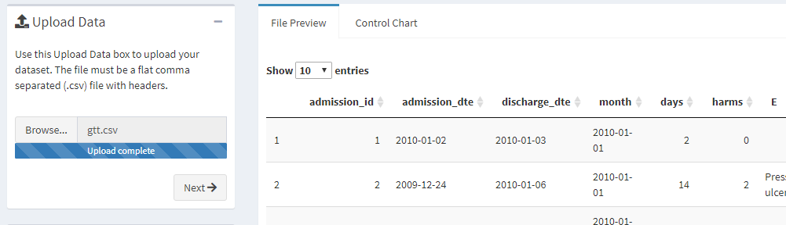
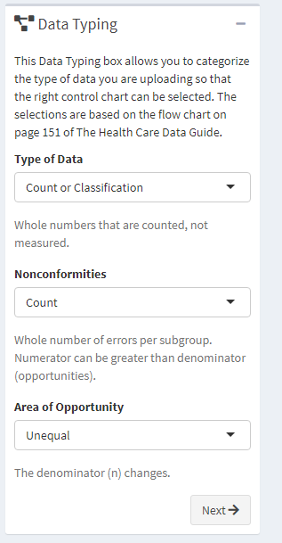
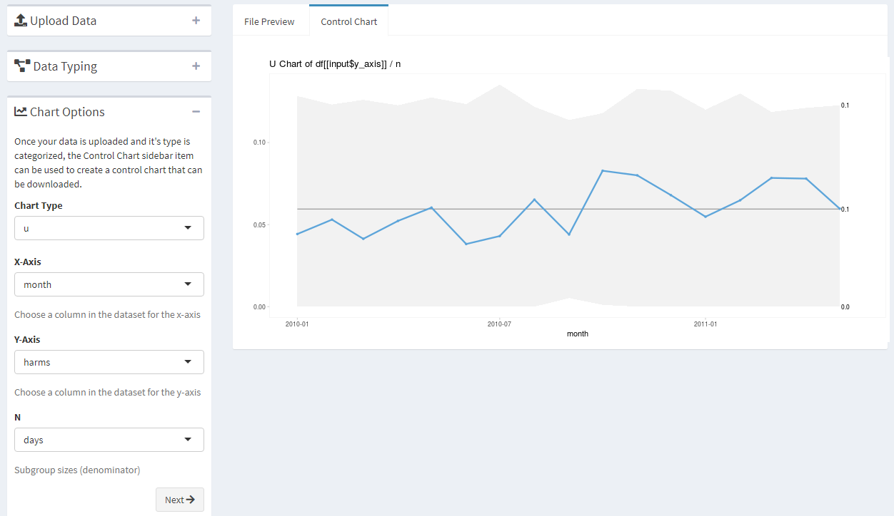
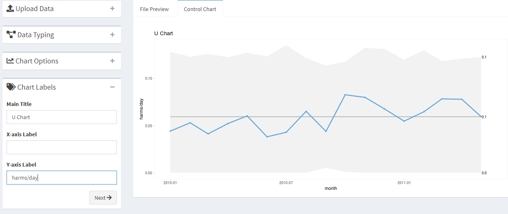
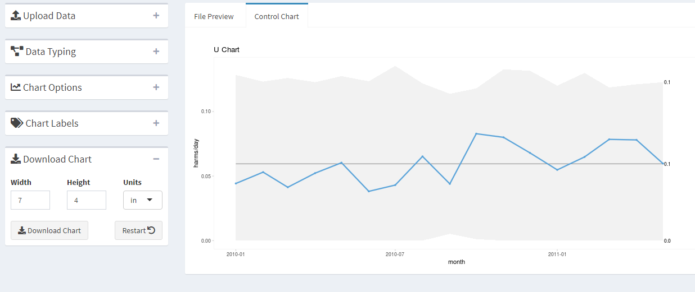

This app can be used to create control charts for data uploaded as a .csv file.
The charts are generated using the 
[`qicharts2` package](https://anhoej.github.io/qicharts2/).

## Upload Data

Use the Upload Data box to upload your dataset. The file must be a flat
comma separated (.csv) file with headers.

Here is an example using the `gtt` dataset in from the `qicharts2` package.

## Data Typing

The Data Typing box allows you to categorize the type of data you are
uploading so that the right control chart can be selected. The selections are
based on the flow chart on page 151 of [The Health Care Data Guide](https://www.amazon.com/Health-Care-Data-Guide-Improvement/dp/0470902582/ref=sr_1_1?keywords=the+health+care+data+guide&qid=1569593782&sr=8-1).

The `gtt` dataset contains information about adverse events during
hospitalization using the Global Trigger Tool. These are counts of adverse
effects where the denominator changes over time.

## Chart Options

The Chart Options box lets you choose the chart type, the column in the data set
for the axes, and the column for the denominator. 

## Chart Labels

You can change the main title and axis labels in the Chart Labels box.

## Download

The chart can then be downloaded.

